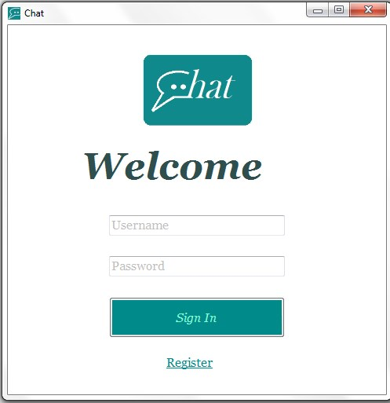
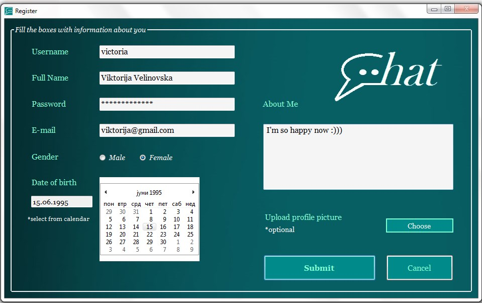
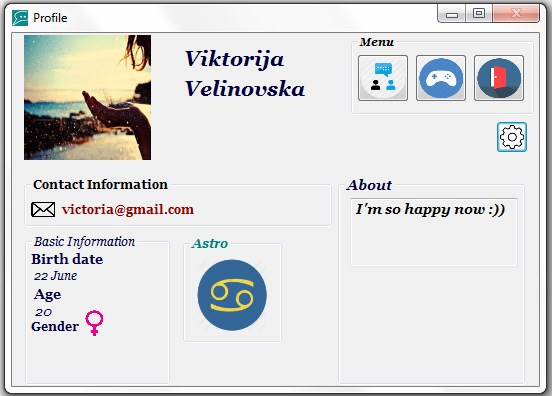
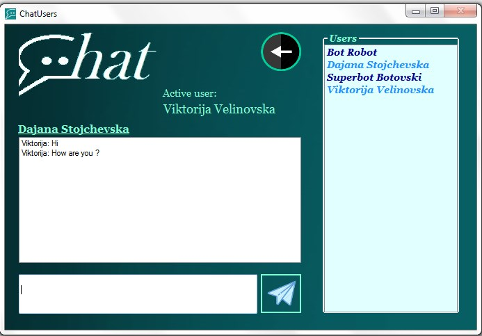
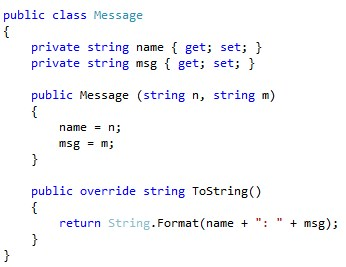
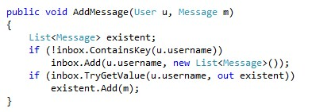

# Chat
Chat Application - Visual Programming Project 
Made by: ***Viktorija Velinovska*** and ***Dajana Stojchevska*** 
Download [Chat.exe](https://github.com/DajanaS/Chat/blob/master/Chat/bin/Debug/Chat.exe)

----------
**Македонски** / [English](#1-description)

##1. Опис на апликацијата
Апликацијата која што ја изработивме претставува Chat – апликација.
Таа им овозможува на корисниците да се најават или да си креираат нов `account`. Откако корисникот ќе се најави со своето корисничко име и лозинка му се прикажува неговиот профил кој ги содржи информациите внесени при неговата регистрација. На оваа форма покрај инфомациите има и неколку копчиња кои служат за навигација низ другите форми. На корисникот му се нуди можност да ги види другите корисници, да одбере игра, да се одјави или пак да направи `edit` на својот профил. Доколку одбере опција `friends` му се прикажува форма за допишување каде всушност се излистани сите регистрирани корисници на апликацијата. Тука тој може да испрати порака на било кој од нив. Кога корисникот за кој се наменети пораките ќе се најави и одговори на нив, првичниот корисник, секако, ќе може да ги види и новите примени пораки во истата форма. Понатаму, доколку се кликне на копчето `play game` на корисникот му се отвара мала игра со букви, која може да ја игра неограничен број пати. За излез од апликацијата, доколку корисникот се наоѓа на форма која што не е неговиот профил, тогаш е потребно прво да се врати на профилната форма и потоа да кликне на копче `sign out`. Ова копче ќе го доведе до почетната форма за најава, каде што апликацијата може да се исклучи. На било која друга форма копчето Close e оневозможено.

##2. Упатство за користење на апликацијата
###2.1 Почетна форма за најава
Со стартување на апликацијата на корисникот му се прикажува почетната форма. 
 
Тука тој може да се најави доколку веќе има постоечки `account`, односно да се регистрира доколку нема, со кликнување на `Register`.
###2.2 Форма за регистрација
Штом кликне `Register` на корисникот му се овозможува да се регистрира на системот. Се прикажува форма за креирање нов  кориснички профил во која тој може да ги внесе своите податоци. Сите полиња се задолжителни освен профилната слика. Доколку корисникот сака да постави своја слика тоа може да го направи со клик на `choose` копчето, во спротивно ќе му се генрира рандом слика од страна на апликацијата во зависност од неговиот пол. Формата за регистрација изгледа вака: 
 
Со кликнување на копчето `cancel` се откажува креирањето на корисничкиот профил и повторно се прикажува почетната форма за најава. Со клик на `submit` се креира профил на корисникот и тој се пренасочува на нова форма - Профил.
###2.3 Профил
Веднаш по најавата или регистрацијата, на корисникот му се прикажува Профил - формата. Таа изгледа вака: 
 
Тука се прикажани информации за корисникот, аватарот, мени со копчиња, како и две дополнителни сликички. Едната слика се генерира според полот на корисникот, а другата го претставува хороскопскиот знак кој апликацијата сама го одредува во зависност од внесената дата на раѓање. Првото копче од менито води кон нова форма на која е прикажана листата со корисници на кои може да им се испраќаат пораки. Со клик на второто копче се прикажува форма во која може да се игра мала игра со букви, а третото копче е копче за одјавување на корисникот - `sign out`. Тоа е единствено копче во целата апликација преку кое тековниот корисник може да се одјави, со цел друг корисник потоа да се најави на апликацијата. Копчето кое се наоѓа под менито е `edit` копче преку кое се нуди можност корисникот да го промени својот опис - делот `about`, како и својата фотографија - со клик на сликичката-камера. 
Тоа е прикажано на следната слика: 
 
Со клик на `save` се зачувуваат направените промени.
###2.4 Форма за допишување
На оваа форма се наоѓа листата со корисници. Има неколку предефинирани корисници. Најавениот (активен) корисник не се наоѓа на оваа листа. Ако се селектира некој од корисниците, тогаш се прикажуваат нови елементи за допишување и гледање на досегашниот разговор со селектираниот корисник. Ако немаат разменето пораки, тогаш се прикажува празна листа. Копчето `send` се наоѓа веднаш до textbox-от за пишување нова порака. Ова копче се активира, односно се испраќа порака, при секое притиснување на тастерот Enter. 

###2.5 Мини игра
Откако корисникот одбрал копче `game` ќе се отвори оваа форма каде со клик на `play` почнуваат да „паѓаат“ букви. 
*Кратко упатство:* Како што се појавуваат буквите на екранот, корисникот треба да ги притисне истите на тастатура. Играта може и да се паузира, а кога ќе се кликне на `stop` се испишува процент на погодоци. Играта може да се игра неограничен број пати.

##3. Решение на проблемот
Нашиот проект го реализиравме со помош на пет форми и четири класи. 
Класите кои ги креиравме за потребите на апликацијата се `User` и `Message`. 
Останатите две класи (за имплементација на мини играта) беа преземени од задача од аудиториски вежби и нив им беше направена минимална промена.
Класата `Message` e едноставна класа која го содржи името на испраќачот и содржината на пораката. 
 
Во класата [User](https://github.com/DajanaS/Chat/blob/master/Chat/User.cs) покрај податоците кои ги внесува корисникот при неговата регистрација, се чува и `Dictionary` кој претставува еден вид на inbox во кој се чуваат пораките. Сите пораки кои се разменети меѓу даден корисник со секој друг корисник поединечно, се чуваат во него така што `key` е корисничкото име на корисникот со кој најавениот корисник се допишувал, а `value` е листа од објекти од класата `Message`, односно сите пораки кои тие меѓусебно си ги размениле.
Додавањето на нова порака во тој inbox е претставено со следнава функција: 
 
Се проверува дали корисникот претходно има разменети пораки со селектираниот корисник. Ако има, тогаш новата порака само се додава во веќе постоечката листа со пораки. Во спротивно,  се креира нова и испраќачот и неговата порака се додаваат како нов елемент во `Dictionary`.

----------
----------
[Македонски](#chat) / **English**

##1. Description
The application that we made represents Chat – application.
It allows the users to sign in or to create a new `account`. Once the user signs in with their username and password, their profile with all the information entered during registration process is displayed. On this form, besides the information, there are few buttons that are used to navigate among the forms. It is possible for the user to see the other users, to play a game, to sign out or to edit their profile. If the option `friends` is chosen, then a form for chatting is displayed where all the registered users on the application are listed. Here the user can send a message to any of them. When the user that those messages are intended to signs in and replays, the initial user, of course, will be enabled to see the new received messages in the same form. Furthermore, if the button `play game` is clicked, a small letters game to the user is opened which can be played unlimited number of times. To exit the application, if the user currently is on a form that is not their profile, then it is needed to switch back to the profile form and to click the `sign out` button afterwards. This button leads to the starter form, where the application can be closed. On any other form the button Close is disabled.

##2. Guide for using the application
###2.1 Sign In
As application is started, the main starting form is displayed to the user. 
 
Here they can sign in if they have an existing `account` already, or they can register if they do not, by clicking `Register`.
###2.2 Registration
Once `Register` is clicked, the user is allowed to register on the system. A form for creating new user profile is shown in which the user can enter data. All the fields are required except the profile picture. If the user wants to upload a picture, it can be done by clicking the `choose` button, otherwise random picture from the application will be generated depending of the user's genre. Registration form looks like this: 
 
By clicking `cancel` the user quits from creating a user profile and the main form for Sign In is displayed again. By clicking `submit` a user profile is created and the user is switched to the new form - Profile.
###2.3 Profile
Right after signing in or registering, the Profile - form is displayed to the user. It looks like this: 
 
All the information about the user is here, as well as the avatar, the menu, and two additional small images. The one is generated according to the user's genre, and the other one represents the zodiac sign which the application determines depending of the user's date of birth. The first button from the menu leads to a new form on which users list is displayed. These users can receive messages. By clicking the second button a new form is displayed where you can play mini game with letters, and the third button is used for `sign out`. It is the only button in the entire application through which the currently active user can be signed out, in order another user to be signed in. The button under the menu is `edit` button  through which the user has an option to change their description - the part `about`, as well as their photo - by clicking the camera-thumbnail. 
The form is shown in the picture below: 
 
By clicking `save` the changes that were made are saved.
###2.4 Chatting
Here is the list of all the users. There are some predefined users. The signed in (active) user is not in this list. If a user is selected, then new elements are shown. They are used for chatting and reading the existent conversation with the selected user. If there are no existing messages, then an empty list is shown. The button `send` is right next to the textbox for writing new message. This button gets activated, actually a message is sent, every time the key Enter is pressed. 

###2.5 Letters game
Once the user chose a button `game` this from will be displayed where by clicking `play` letters start „falling“. 
*Short guide:* As the letters appear on the screen, the user should press the same letters on the keyboard. The game can be paused, and when `stop` is clicked, the result is written, actually the percentage of the hits. The game can be played unlimited number of times.

##3. Solution of the problem
We realized our project with five forms and four classes. The classes that we needed to create for this application to work are `User` and `Message`. The other two classes are used for implementing the mini letters game.
The class `Message` is a simple class that consist of the sender's username and the content of the message. 
 
In the class [User](https://github.com/DajanaS/Chat/blob/master/Chat/User.cs) besides the information that the user has entered during registration, we keep a `Dictionary` which represents a kind of inbox in which the messages are kept. All the messages that are exchanged between given user and each user separately, are kept here so that `key` is username of the user which the active user was chatting with, and `value` is a list of objects from the class `Message`, actually all the messages that they exchanged among themselves.
Adding a new message in that inbox is represented with the next function: 
 
We check if the user has previously chatted with the selected user. If the user has, then the new message is just added in the existing messages list. Otherwise, a new one is created and the sender and their message are added as a new element in `Dictionary`.
